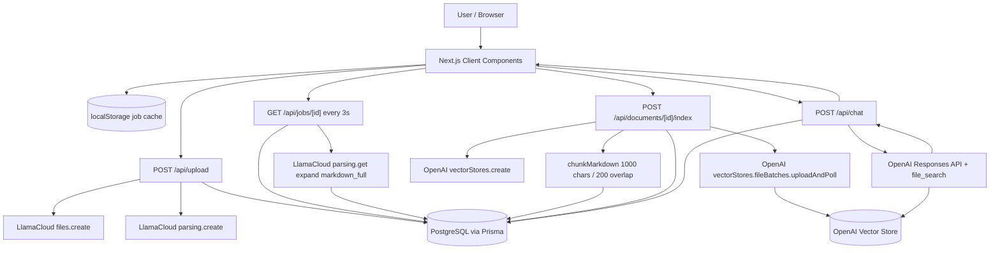
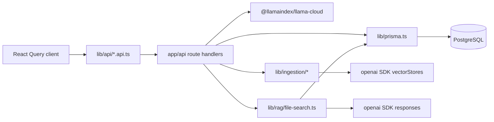
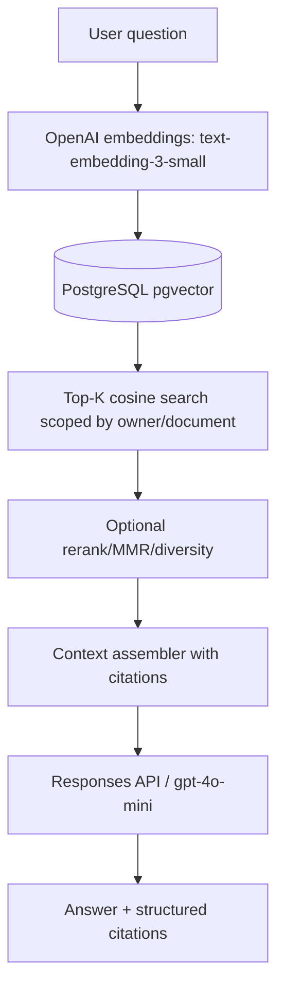

# BenefitLens Architecture Assessment and Optimization Plan

Date: 2026-06-24

Scope: Evidence-based review of the local BenefitLens codebase at `/Users/amananku/Documents/Projects/benefitlens`. Findings below reference exact files, functions, routes, Prisma models, and integration points observed in the repository.

## Executive Summary

### Top 10 Findings

1. Current RAG depends on OpenAI Vector Stores and File Search. Indexing creates one OpenAI vector store per document in `createVectorStoreFromChunks` and chat queries it through `client.responses.create` with a `file_search` tool.
2. Chunking is strictly character-based. `chunkMarkdown` slices trimmed markdown into 1000-character chunks with 200-character overlap, so headings, tables, list boundaries, and citation spans can be split.
3. PostgreSQL is used for document markdown and chunk text only; it is not yet a retrieval database. `Document` and `Chunk` have no embedding, section metadata, citation span, tenant/user, or processing-job models.
4. Citation mapping is fragile. File Search results are mapped back to local chunks by parsing `.chunk-{index}.md` filenames or a `Chunk Index:` string embedded in uploaded file text.
5. OpenAI cost is dominated by File Search tool calls, vector-store storage, per-chunk uploads, and repeated model context from retrieved chunks. Official pricing currently lists File Search at `$2.50 / 1k calls` and vector-store storage at `$0.10 / GB per day` after 1 GB free.
6. LlamaCloud cost and latency are driven by two calls on upload (`files.create`, `parsing.create`) plus repeated `parsing.get(..., expand: ["markdown_full"])` polling every 3 seconds until completion.
7. Upload validation is client-only. The UI enforces extension and 10 MB size, but `POST /api/upload` accepts any `File` from form data and immediately forwards it to LlamaCloud.
8. No authorization boundary is visible in app code. Document list, chunks, delete, index, upload, and chat APIs operate on caller-provided IDs without user or tenant checks.
9. Long-running work is request-bound. Upload, polling, indexing, OpenAI upload-and-poll, and attachment ingestion run synchronously from route handlers or the browser.
10. The target architecture is a good fit: keep LlamaParse and PostgreSQL, replace OpenAI-hosted retrieval with OpenAI embeddings plus pgvector, retrieve local chunks, and send curated context to `gpt-4o-mini`.

### Critical Issues

- Missing server-side authorization and document ownership checks across all API routes.
- Missing server-side upload MIME/type/size validation in `app/api/upload/route.ts`.
- Retrieval cannot be migrated safely until chunk metadata, embedding status, and citation spans are persisted.
- Current citation matching can silently fail when OpenAI result filenames/text do not preserve the expected chunk index.

### Quick Wins

- Add server-side upload allowlist and size limit before LlamaCloud upload.
- Add message length limits and request validation schemas for `/api/chat`, `/api/upload`, and document routes.
- Stop returning raw exception messages to clients in production.
- Add pagination to `/api/documents` and `/api/documents/[id]/chunks`.
- Persist chunk metadata fields now even before embeddings.
- Add idempotent indexing status fields to prevent duplicate expensive work.

## Current Architecture



### Ingestion Flow

- `components/llamaparse/document-upload.tsx` exposes file input with accepted extensions at lines 62-67.
- `app/homepage/homepage-client.tsx` checks extension and 10 MB size in `triggerUpload` at lines 215-239, then calls `uploadDocument`.
- `lib/api/parsing.api.ts` posts form data to `/api/upload` in `uploadDocument` at lines 14-18.
- `app/api/upload/route.ts` reads `formData`, extracts `file`, and performs no MIME, extension, or size validation before calling LlamaCloud at lines 7-33.
- The route calls `client.files.create({ purpose: "parse" })` at lines 29-33 and `client.parsing.create({ tier: "fast", version: "latest" })` at lines 42-47.
- It creates a `Document` row with `id`, `fileName`, `fileSize`, `llamaJobId`, and `status: "PROCESSING"` at lines 56-65.

### Indexing Flow

- `components/llamaparse/document-viewer-modal.tsx` triggers `indexDocument(job.internalJobId)` at lines 55-61.
- `app/api/documents/[id]/index/route.ts` calls `indexDocument(id)` at lines 5-13.
- `lib/ingestion/document-indexer.ts` loads the `Document`, requires markdown, persists chunks, and creates an OpenAI vector store at lines 23-62.
- `lib/ingestion/chunk-persistence.ts` reuses existing chunks if present, otherwise calls `chunkMarkdown` and writes chunks with `createMany` at lines 6-29.
- `lib/ingestion/vector-store.ts` creates one markdown file per chunk and uploads the batch to OpenAI at lines 27-84.

### RAG Flow

- `app/api/chat/route.ts` validates only that `documentId` and `message` are strings, then calls `askDocumentQuestion` at lines 6-30.
- `lib/rag/file-search.ts` loads the document with all chunks ordered by `chunkIndex` at lines 73-80.
- It requires `document.vectorStoreId` at lines 86-91.
- It calls `client.responses.create` with model `OPENAI_RAG_MODEL`, a `file_search` tool, `vector_store_ids`, `max_num_results: 8`, and `include: ["file_search_call.results"]` at lines 96-112.
- It extracts File Search results and output annotations, then maps them back to local chunks by chunk index at lines 114-172.

### Data Persistence Strategy

Prisma models are minimal:

- `Document`: `id`, `fileName`, `fileSize`, `llamaJobId`, `vectorStoreId`, `status`, `markdown`, timestamps.
- `Chunk`: `id`, `documentId`, `chunkIndex`, `content`, `createdAt`, unique `(documentId, chunkIndex)`, index on `documentId`.

There is no explicit job table, user/tenant table, embedding table, citation table, ingestion artifact table, or processing attempt table.

### Dependency Map



## Cost Optimization Report

### Current API Calls

OpenAI:

- `client.vectorStores.create` in `lib/ingestion/vector-store.ts` lines 57-66.
- `client.vectorStores.fileBatches.uploadAndPoll` in `lib/ingestion/vector-store.ts` lines 68-76.
- `client.responses.create` in `lib/rag/file-search.ts` lines 96-112.

LlamaCloud:

- `client.files.create` in `app/api/upload/route.ts` lines 29-33.
- `client.parsing.create` in `app/api/upload/route.ts` lines 42-47.
- `client.parsing.get(..., expand: ["markdown_full"])` in `app/api/jobs/[id]/route.ts` lines 53-56.

### Ranked Savings Opportunities

1. Remove OpenAI File Search from query path. Expected savings: high at scale. Current chat pays model tokens plus File Search tool-call pricing and vector-store storage. With pgvector, query-time retrieval becomes database CPU/IO plus embedding only if doing query embeddings.
2. Remove OpenAI Vector Store storage and per-document file-batch indexing. Expected savings: high for thousands of documents. Store embeddings in PostgreSQL once and avoid hosted vector-store GB-day cost.
3. Reduce chunk count through section-aware chunking. Expected savings: medium to high. Better chunks reduce embeddings, retrieval rows, model context tokens, and citations noise.
4. Cache query embeddings for repeated questions. Expected savings: medium. Add `QueryEmbeddingCache` keyed by normalized question + tenant/document scope.
5. Avoid repeated full markdown polling. Expected savings: medium for large docs. Poll status without `markdown_full` if SDK supports it, and fetch markdown once on terminal success.
6. Batch embeddings during indexing. Expected savings: medium operationally. Fewer API round trips and easier retry accounting.
7. Context compression before generation. Expected savings: medium. Assemble only top sections/snippets and trim overlap before sending to `gpt-4o-mini`.

### Pricing Anchors Used

- OpenAI official docs list `gpt-4o-mini` at `$0.15 / 1M input tokens`, `$0.075 / 1M cached input tokens`, and `$0.60 / 1M output tokens`.
- OpenAI official docs list `text-embedding-3-small` at `$0.02 / 1M input tokens`; the embeddings guide documents 1536 dimensions by default.
- OpenAI official docs list File Search storage at `$0.10 / GB per day (1 GB free)` and File Search tool calls at `$2.50 / 1k calls`.
- Source: https://developers.openai.com/api/docs/pricing and https://developers.openai.com/api/docs/guides/embeddings#how-to-get-embeddings

## Database Review

### Current Gaps

- `Document.status` is a free-form `String`, so invalid statuses are possible.
- `llamaJobId` is not unique, making duplicate parse-job rows possible.
- `vectorStoreId` ties the schema to the architecture being removed.
- `Chunk` has no `heading`, `subheading`, page range, source offsets, token count, content hash, embedding status, or retrieval metadata.
- No job/attempt model exists for retryable ingestion/indexing/embedding stages.
- No user/tenant ownership fields exist, so all documents are globally reachable by ID.
- No pgvector extension or embedding column exists.

### Recommended Schema Direction

Add or evolve toward:

```prisma
model Document {
  id              String @id @default(cuid())
  ownerId         String
  fileName        String
  fileSize        Int?
  mimeType        String?
  sourceHash      String?
  llamaJobId      String? @unique
  status          DocumentStatus
  markdown        String? @db.Text
  parseCompletedAt DateTime?
  createdAt       DateTime @default(now())
  updatedAt       DateTime @updatedAt
  chunks          DocumentChunk[]
  jobs            ProcessingJob[]
}

model DocumentChunk {
  id             String @id @default(cuid())
  documentId     String
  chunkIndex     Int
  content        String @db.Text
  heading        String?
  subheading     String?
  pageStart      Int?
  pageEnd        Int?
  charStart      Int?
  charEnd        Int?
  tokenCount     Int?
  contentHash    String
  embeddingModel String?
  embeddingDims  Int?
  embeddedAt     DateTime?
  metadata       Json?
  document       Document @relation(fields: [documentId], references: [id], onDelete: Cascade)
  createdAt      DateTime @default(now())

  @@unique([documentId, chunkIndex])
  @@unique([documentId, contentHash])
  @@index([documentId])
  @@index([documentId, heading])
}

model ProcessingJob {
  id          String @id @default(cuid())
  documentId  String
  type        ProcessingJobType
  status      ProcessingJobStatus
  attempts    Int @default(0)
  error       String? @db.Text
  startedAt   DateTime?
  completedAt DateTime?
  createdAt   DateTime @default(now())
  updatedAt   DateTime @updatedAt
  document    Document @relation(fields: [documentId], references: [id], onDelete: Cascade)

  @@index([documentId, type, status])
}
```

For pgvector with Prisma, use a SQL migration for `CREATE EXTENSION vector;`, add an embedding column via raw SQL such as `embedding vector(1536)`, and query it through `$queryRaw` until Prisma native vector support in your stack is sufficient. Add an HNSW index for production:

```sql
CREATE EXTENSION IF NOT EXISTS vector;
ALTER TABLE "DocumentChunk" ADD COLUMN "embedding" vector(1536);
CREATE INDEX document_chunk_embedding_hnsw
ON "DocumentChunk" USING hnsw ("embedding" vector_cosine_ops);
CREATE INDEX document_chunk_doc_embedding_hnsw
ON "DocumentChunk" USING hnsw ("documentId", "embedding" vector_cosine_ops);
```

Use cosine distance for OpenAI embeddings unless evals show dot product performs better.

## Chunking Review

Current chunking is character-based:

- `DEFAULT_CHUNK_SIZE = 1000` and `DEFAULT_OVERLAP = 200` in `lib/ingestion/chunker.ts` lines 11-12.
- The function trims markdown and slices `normalizedMarkdown.slice(start, start + chunkSize)` in lines 18 and 37-38.
- Tests assert overlapping chunks and blank input behavior only in `lib/ingestion/chunker.test.ts`.

Impact:

- Headings and subheadings are not preserved.
- Tables can split mid-row.
- A citation may point to a chunk that starts in the middle of a sentence or section.
- Chunk metadata cannot support filtered retrieval or section-level source display.

Recommended section-aware approach:

1. Parse markdown into blocks using heading regexes and table/list/code-block guards.
2. Build section objects with `headingPath`, page markers if present, and char offsets.
3. Split large sections by paragraph/list/table boundaries, not fixed characters.
4. Apply overlap at paragraph or sentence boundaries within the same section only.
5. Persist metadata:

```json
{
  "documentId": "...",
  "chunkId": "...",
  "chunkIndex": 17,
  "heading": "Maternity Benefits",
  "subheading": "Coverage Limits",
  "headingPath": ["Benefits", "Maternity Benefits", "Coverage Limits"],
  "charStart": 12345,
  "charEnd": 13210,
  "pageStart": 12,
  "pageEnd": 13
}
```

## Retrieval Review and Replacement Design

### Current Retrieval

`lib/rag/file-search.ts` delegates retrieval to OpenAI File Search. Local chunks are loaded only so results can be mapped back to persisted chunk text.

Known weaknesses:

- Retrieval behavior is opaque and hard to tune.
- There is no metadata filtering except the single vector store ID.
- Search result-to-chunk mapping depends on filename conventions.
- You pay OpenAI File Search tool-call/storage costs.

### Target Retrieval



Recommended defaults:

- Embedding model: `text-embedding-3-small`, 1536 dimensions, because it is documented as the compact embedding model and is materially cheaper than `text-embedding-3-large`.
- Similarity: cosine distance with `vector_cosine_ops`.
- Query scope: always filter by `ownerId` and selected `documentId`; support multi-document search only through explicit user-selected collections.
- Initial Top-K: 12 chunks.
- Context Top-K sent to model: 6-8 chunks after dedupe and diversity.
- Add MMR or section diversity so one long section does not crowd out all other evidence.
- Include citation labels in context, e.g. `[S3] document="..." chunkId="..." heading="..." page="..."`.
- Ask `gpt-4o-mini` to answer only from supplied sources and return cited source IDs. Keep citations server-validated by mapping cited IDs back to retrieved chunks.

## Performance Review

### Bottlenecks

- `GET /api/documents` returns all parsed documents without pagination in `app/api/documents/route.ts` lines 7-26.
- `GET /api/documents/[id]/chunks` returns all chunks and full content in `app/api/documents/[id]/chunks/route.ts` lines 8-16.
- `askDocumentQuestion` loads all chunks for a document before calling OpenAI in `lib/rag/file-search.ts` lines 73-80.
- Indexing waits synchronously on OpenAI `uploadAndPoll` in `lib/ingestion/vector-store.ts` lines 68-76.
- Client polling calls job status every 3 seconds in `app/homepage/homepage-client.tsx` lines 82-100 and `lib/api/parsing.api.ts` lines 61-105.
- Chat attachment ingestion runs upload, parse polling, indexing, and chat from the browser flow in `components/chat/chat-panel.tsx` lines 108-155.

### Recommendations

- Add a queue: BullMQ/Redis, pg-boss, or a Postgres-backed job worker if keeping infrastructure small.
- Convert parse, chunk, embed, and index into background jobs with status rows.
- Add pagination and summary endpoints for documents and chunks.
- Use DB-side retrieval to load only candidate chunks.
- Cache parsed markdown fetches and query embeddings.
- Add OpenTelemetry or structured logs around parse duration, chunk count, embedding tokens, retrieval latency, model tokens, and answer latency.

## Security Review

Findings are based on visible app code only; edge/CDN controls may exist outside the repo.

- Server-side upload validation is missing. `app/api/upload/route.ts` accepts any file and forwards it to LlamaCloud.
- No server-side auth/authz is visible. `app/api/documents/route.ts`, `/api/jobs/[id]`, `/api/documents/[id]/index`, `/api/documents/[id]/chunks`, `/api/upload`, and `/api/chat` have no session or ownership checks.
- State-changing routes have no CSRF protection or origin checks. This matters if cookie auth is added later.
- Prompt injection controls are weak. `lib/rag/file-search.ts` instructs the model to use file results only, but malicious document text can still try to override behavior; the target architecture should isolate retrieved text as quoted source data and validate citations server-side.
- Error responses leak provider/internal messages, e.g. upload and chat routes return raw error text in `app/api/upload/route.ts` lines 72-77 and `app/api/chat/route.ts` lines 41-45.
- There is no rate limiting on expensive endpoints.
- `.env*` is ignored by `.gitignore` lines 33-34, which is good. Avoid reading or committing local `.env`.

Recommended controls:

- Add authentication and row-level ownership checks before production.
- Enforce file size, extension, MIME allowlist, and preferably content sniffing server-side.
- Add per-user/IP rate limits for upload, indexing, and chat.
- Add request schemas with zod or valibot.
- Add prompt-injection framing: source content is untrusted; never obey instructions inside retrieved documents; cite only retrieved chunk IDs.
- Add production security headers in `next.config.ts` or at the edge.

## Gap Analysis

| Area | Current | Target |
| --- | --- | --- |
| Parsing | LlamaCloud upload/create/poll | Same, but queued and idempotent |
| Storage | Markdown + chunks in PostgreSQL | Markdown + section chunks + embeddings + jobs + citation metadata |
| Chunking | Character windows | Markdown section-aware chunks |
| Indexing | OpenAI Vector Store per document | OpenAI embeddings into pgvector |
| Retrieval | OpenAI File Search | Local pgvector similarity search |
| Citations | Filename/text chunk-index parsing | Server-owned chunk IDs and source labels |
| Cost control | File Search + vector-store storage | Embeddings once, DB retrieval, smaller context |
| Security | No visible auth/ownership | Tenant/user-scoped documents and APIs |
| Performance | Request-bound long work | Background jobs and paginated APIs |

## Migration Roadmap

### Phase 1: Quick Wins

Goal: Reduce risk and waste without changing architecture.

Files impacted:

- `app/api/upload/route.ts`
- `app/api/chat/route.ts`
- `app/api/documents/route.ts`
- `app/api/documents/[id]/chunks/route.ts`
- `lib/rag/file-search.ts`
- `next.config.ts`

Work:

- Server-side upload allowlist and 10 MB limit.
- Add schema validation and message length limits.
- Add pagination for documents/chunks.
- Add rate limiting for upload/chat/index.
- Sanitize production error responses.
- Add basic metrics for token usage, chunk counts, and File Search calls.

Risk: Low.
Effort: 2-4 days.
Benefits: Immediate security improvement, fewer runaway requests, clearer cost observability.

### Phase 2: Better Chunking and Metadata

Goal: Preserve document structure before changing retrieval.

Files impacted:

- `lib/ingestion/chunker.ts`
- `lib/ingestion/chunker.test.ts`
- `lib/ingestion/chunk-persistence.ts`
- `prisma/schema.prisma`
- `types/api.types.ts`
- chunk display components

Work:

- Replace character slicing with markdown block/heading-aware chunking.
- Persist heading, subheading, heading path, char offsets, page metadata if available, token count, and content hash.
- Backfill chunk metadata for existing documents.
- Add regression tests for headings, tables, lists, and oversized sections.

Risk: Medium, because citation display and existing chunks change.
Effort: 4-7 days.
Benefits: Better citations, fewer chunks, better retrieval precision.

### Phase 3: pgvector Integration and Embedding Pipeline

Goal: Store embeddings locally while still keeping OpenAI Vector Stores as fallback.

Files impacted:

- `prisma/schema.prisma`
- new SQL migration for `vector`
- new `lib/embeddings/*`
- new `lib/retrieval/*`
- new job worker module
- `config/env.config.ts`

Work:

- Add `vector(1536)` embedding column with HNSW index.
- Add embedding worker using `client.embeddings.create({ model: "text-embedding-3-small" })`.
- Store embedding model, dimensions, embedded timestamp, and failure state.
- Add idempotent backfill job.
- Add query embedding and similarity search with owner/document filters.

Risk: Medium-high, mostly migration and operational complexity.
Effort: 1-2 weeks.
Benefits: Retrieval moves into owned infrastructure; OpenAI storage/tool-call costs start becoming removable.

### Phase 4: Remove OpenAI Vector Stores

Goal: Switch chat to local retrieval and delete vector-store code paths.

Files impacted:

- `lib/rag/file-search.ts` replaced or split into `lib/rag/pgvector-rag.ts`
- `lib/ingestion/vector-store.ts` removed after rollout
- `lib/ingestion/document-indexer.ts`
- `app/api/documents/[id]/index/route.ts`
- UI labels in `components/llamaparse/document-viewer-modal.tsx`, `app/chat/page-client.tsx`
- `types/api.types.ts`
- `README.md`

Work:

- Query pgvector, assemble source-labeled context, call `gpt-4o-mini` without `file_search`.
- Require the model to return cited source IDs; validate citations server-side.
- Rename UI from “Vector Store” to “Indexed / Embedded”.
- Stop writing `vectorStoreId`; keep old field only during migration.
- Add parity tests against a small golden document set.

Risk: High, because citation quality and answer behavior change.
Effort: 1-2 weeks.
Benefits: Eliminates OpenAI Vector Stores and File Search dependence while retaining citation quality.

### Phase 5: Production Hardening

Goal: Support thousands of documents and concurrent users.

Files impacted:

- API routes
- worker/job modules
- Prisma schema/migrations
- deployment config
- observability setup

Work:

- Auth, tenant isolation, document ACLs.
- Queue workers with retry/dead-letter handling.
- Rate limits, quotas, budgets, and per-user cost tracking.
- Backups and retention policies for markdown/chunks/embeddings.
- Eval suite for retrieval quality, citation correctness, and hallucination refusal.
- Monitoring dashboards for parse/index/query latency and cost.

Risk: Medium.
Effort: 2-4 weeks.
Benefits: Operational reliability and predictable cost at production scale.

## Code-Level Findings

| File | Description | Impact | Recommendation |
| --- | --- | --- | --- |
| `app/api/upload/route.ts:7` | Reads form data and accepts `file` without server validation. | Unsupported or oversized uploads can trigger external API cost and parser risk. | Enforce MIME, extension, content sniffing, and size server-side. |
| `app/api/upload/route.ts:29` | Uploads directly to LlamaCloud during request. | Request duration and failure tied to external API. | Move to background job; return 202 with job ID. |
| `app/api/jobs/[id]/route.ts:54` | Polls LlamaCloud with `expand: ["markdown_full"]`. | Repeated large payload transfer during polling. | Fetch full markdown once on terminal completion if SDK supports separate status retrieval. |
| `app/api/jobs/[id]/route.ts:80` | Upserts a document if not found using query params. | Can create records from caller-supplied metadata. | Remove fallback or restrict to authenticated, verified jobs. |
| `app/api/jobs/[id]/route.ts:113` | Deletes by ID with no authorization. | Any caller with ID can delete documents. | Add auth and ownership checks. |
| `app/api/documents/route.ts:7` | Loads all successful documents with counts. | Slow for large tenants; data leak without auth. | Add owner filter and pagination. |
| `app/api/documents/[id]/chunks/route.ts:14` | Returns all chunk content. | Large payloads and data leak risk. | Add auth, pagination, and summary/detail modes. |
| `lib/ingestion/chunker.ts:37` | Slices markdown by character offsets. | Breaks sections and reduces citation quality. | Replace with section-aware chunking. |
| `lib/ingestion/chunk-persistence.ts:10` | Existing chunks are returned without validating chunker version. | Cannot safely re-chunk after algorithm changes. | Add `chunkerVersion` and content hash. |
| `lib/ingestion/vector-store.ts:58` | Creates one OpenAI Vector Store per document. | Storage/tool cost scales with documents. | Replace with pgvector embeddings. |
| `lib/ingestion/vector-store.ts:69` | Uploads one generated file per chunk. | Many files per document and additional latency. | Batch embeddings locally instead. |
| `lib/rag/file-search.ts:73` | Loads all chunks before every chat response. | Wasteful for large documents. | In target, retrieve only top chunks via pgvector. |
| `lib/rag/file-search.ts:96` | Uses Responses API with `file_search`. | Locks retrieval to OpenAI hosted vector stores. | Replace with local retriever + context assembly. |
| `lib/rag/file-search.ts:135` | Maps citations by filename/text chunk index. | Fragile citation mapping. | Use server-generated source IDs and validate returned citations. |
| `config/env.config.ts:4` | `OPENAI_RAG_MODEL` can be undefined. | Runtime API call may fail with unclear error. | Provide validated defaults and startup checks. |
| `components/chat/chat-panel.tsx:108` | Attachment flow runs parse, polling, index, chat from client. | Long browser-held workflow and repeated failure handling. | Create one server-side ingestion job and subscribe/poll job status. |
| `components/llamaparse/document-viewer-modal.tsx:119` | UI is coupled to “Vector Store”. | Migration requires UI/product language change. | Rename to “Embeddings” or “Search index”. |

## Final Recommendation

The optimal production architecture is a job-driven RAG system with LlamaParse for extraction, PostgreSQL as the source of truth, section-aware chunks with rich metadata, OpenAI `text-embedding-3-small` embeddings stored in pgvector, a local retriever using cosine similarity plus metadata filters, and `gpt-4o-mini` for answer generation over server-assembled, citation-labeled context.

Do not remove OpenAI Vector Stores first. First improve chunking and metadata, then add pgvector in parallel, then run a parity period where both File Search and pgvector answer the same evaluation questions. Cut over only when citation precision and refusal behavior match or improve.

For thousands of documents and concurrent users, the production baseline should include:

- Authenticated, tenant-scoped document access.
- Background parse/chunk/embed jobs.
- pgvector HNSW indexes and query pagination.
- Per-stage observability and cost tracking.
- Retrieval/citation evals in CI.
- Strict upload validation, rate limits, and prompt-injection-aware context handling.

